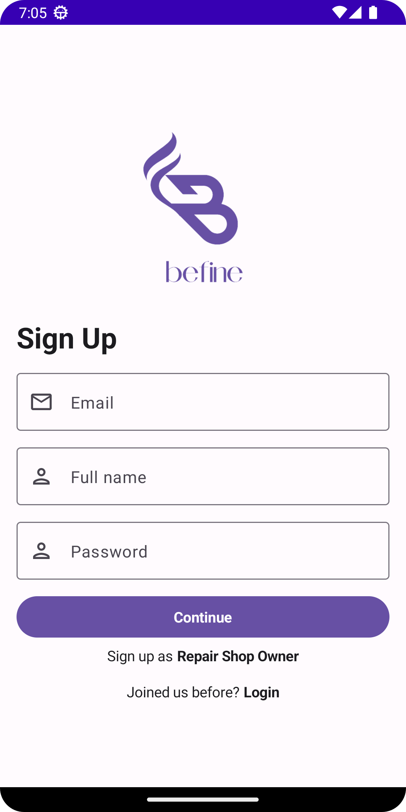

<h1 align="center">
  <br>
</h1>

# Befine

BEFINE is a mobile application designed to provide users with a seamless experience in locating and accessing nearby automotive repair shops.

This comprehensive solution aims to address the challenges faced by users when searching for and communicating with repair shops, especially in unfamiliar locations.

By leveraging the power of geolocation technology, BEFINE enables users to find repair shops based on their current location, ensuring convenience and efficiency in their automotive repair needs.
## Tech Stack

**Android:** [Kotlin](https://kotlinlang.org/), [Jetpack Compose 3](https://developer.android.com/jetpack/androidx/releases/compose-material3), [Coil](https://coil-kt.github.io/coil/compose/), [Leku](https://github.com/AdevintaSpain/Leku#usage), [Jetpack Library](https://developer.android.com/jetpack), [Lottie](https://lottiefiles.com/), [Android Studio](https://developer.android.com/studio), [Google Maps SDK for Android](https://developers.google.com/maps/documentation/android-sdk)

**Server:** [Firebase Authentication](https://firebase.google.com/docs/auth), [Firebase Realtime Database](https://firebase.google.com/docs/database), [Firebase Firestore Database](https://firebase.google.com/docs/firestore), [Firebase Storage](https://firebase.google.com/docs/storage/).

## Features

- **Authentication**
    - Login
    - Register
- **Message**
    - Client to Repair Shop Owner
    - Repair Shop Owner to Client
    - Find message by receiver name
- **Repair Shop**
    - Edit repair shops information
    - Find repair shops based on repair shops name
    - See operational schedule of repair shops
    - See location of repair shops in maps


## Installation
1. Clone repository
```bash
  git clone https://github.com/Rhtymn/Befine.git
```
2. Open project using Android Studio
3. Run the application with your device or emulator
    
## Screenshots
### Authentication
  

### Profile
 

### Client Home
  

### Repair Shop Details


### Message Channel List


### Message Chatroom


### Repair Shop Home


### Repair Shop Edit
  


## Contact

- [Github](https://www.github.com/Rhtymn)
- [Linkedin](https://www.linkedin.com/in/mhroihan/)

